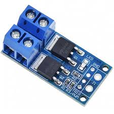
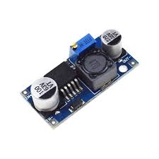
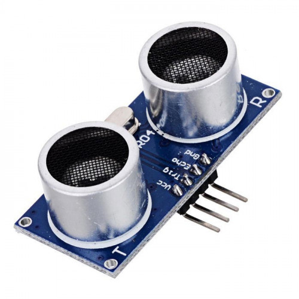
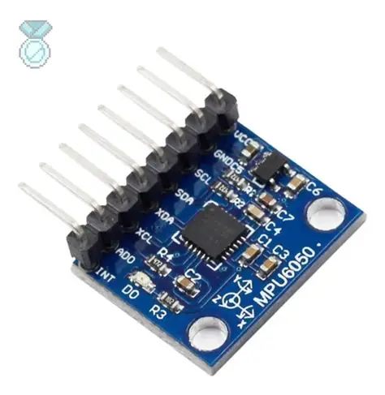
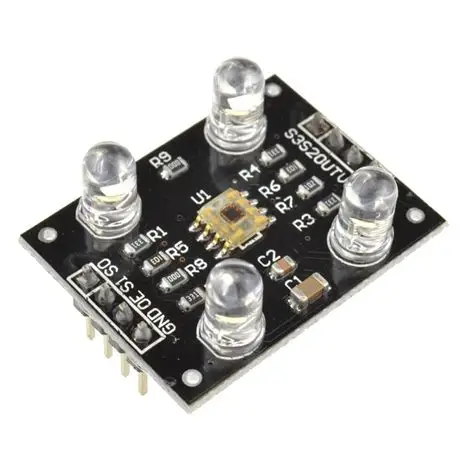
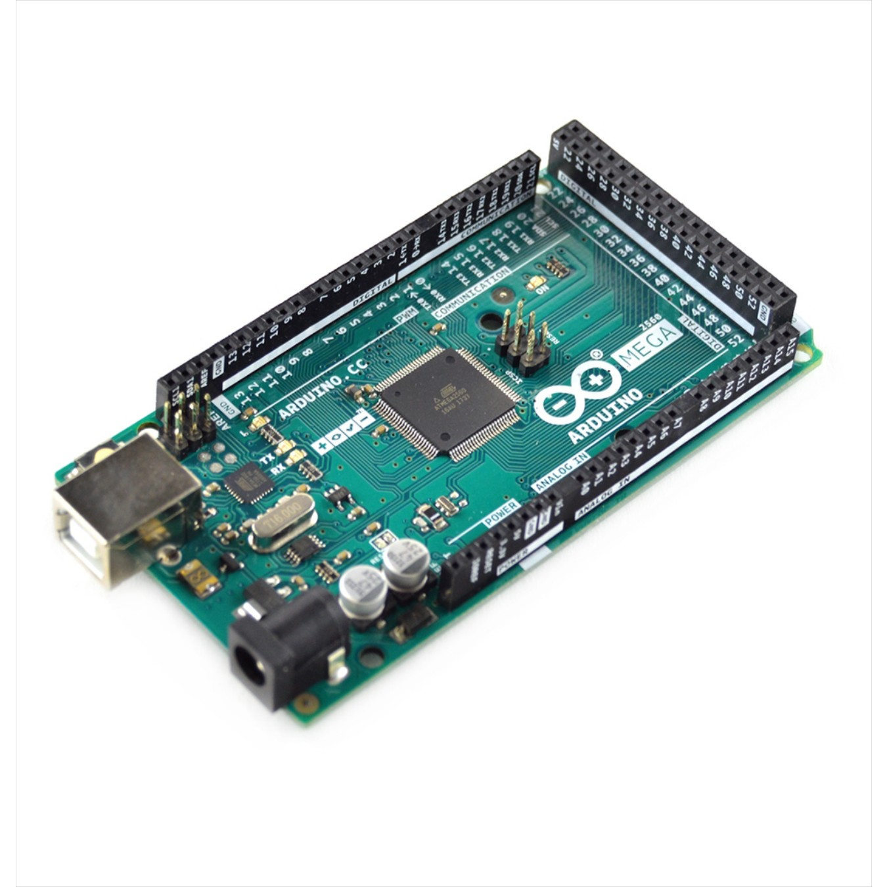

# Chispas team – WRO 2025 Project

Welcome to the official repository of the **Chispas team**!  
This space contains all the resources, schematics, models, photos, and code developed for our participation in the **Future Engineers** challenge at the **World Robot Olympiad 2025**.

Here you’ll find detailed information about the design, functionality, and technical documentation of our autonomous vehicle.

---

## 📸 Team Photos

Below are two images that reflect our team’s identity:

| 📷 Official Photo | 😄 Fun Photo |
|------------------|--------------|
|  |  |

---

## 🚗 Vehicle View

Here you can see the full design of the vehicle from every angle. This detailed view helps to understand the layout of components and overall structure.

| Front | Back | Left |
|--------|---------|-----------|
|  |  |  |

| Right | Top | Bottom |
|--------|----------|----------|
|  |  |  |

---

<h2 align="left">🧠 Electromechanical Components & Wiring</h2>

<table>
  <tr>
    <td align="center">
       
      <b>3-Pin Switch</b>
    </td>
    <td align="center">
       
      <b>Servo MG945</b>
    </td>
    <td align="center">
       
      <b>Raspberry Pi 4</b>
    </td>
  </tr>

  <tr>
    <td align="center">
       
      <b>JGA25-370 Motor</b>
    </td>
    <td align="center">
       
      <b>LiPo Battery 1200mAh 12V</b>
    </td>
    <td align="center">
       
      <b>Limelight 3A</b>
    </td>
  </tr>

  <tr>
    <td align="center">
       
      <b>HC-SR04 Sensor</b>
    </td>
    <td align="center">
       
      <b>L298N Motor Driver</b>
    </td>
    <td align="center">
       
      <b>HC-SR04 Sensor</b>
    </td>
  </tr>

  <tr>
    <td align="center">
       
      <b>GY-251 Gyroscope</b>
    </td>
    <td align="center">
       
      <b>TCS3200 Color Sensor</b>
    </td>
    <td align="center">
       
      <b>Arduino Mega</b>
    </td>
  </tr>
</table>

---

### 📊 Wiring Diagram

Below is the full electromechanical schematic that shows how everything is connected:

> You can find this image and other versions in the [`schemes`](schemes/) folder.

---

## 🔧 Components and Sensor Integration

Our robot was built using a mix of modular components from an existing kit and custom-designed 3D printed parts to fit the needs of the Future Engineers challenge. This hybrid approach allowed us to maximize the strengths of reliable, pre-tested hardware while also tailoring specific solutions for unique tasks in the mission. Below is a highly detailed breakdown of all the components we used, their technical roles, the integration logic, issues we faced, and how we adapted to overcome them. Our documentation not only reflects the functionality of each part, but also highlights the engineering decisions made throughout the robot’s development.

### 🔋 Power Supply 

**LiPo Battery 1200mAh 12V**

- Powers the entire robot system, ensuring both mobility and computational processing are supported throughout the match.  
- Provides stable power output for the motors, sensors, Raspberry Pi, and Arduino.  
- We used a voltage regulator to avoid current spikes and protect delicate components like microcontrollers.  
- This solution helped mitigate early issues we faced with sudden shutdowns during intensive operations.  
- A battery monitor was also incorporated to measure real-time voltage and alert us when levels dropped too low.

### 💻 Main Controllers

**Raspberry Pi 4**

- Acts as the central processing hub of the robot.  
- Responsible for image processing, decision-making logic, and managing sensor data.  
- Runs Python scripts to interpret input from the Limelight and communicates with the Arduino through a serial interface.  
- Its high-speed processing capabilities allow us to manage simultaneous tasks like pathfinding, obstacle avoidance, and turn correction.  
- Includes an external cooling fan and heat sinks to maintain optimal temperature during extended operations.

**Arduino MEGA**

- Controls low-level tasks such as PWM motor control and real-time sensor readings (e.g., ultrasonic distance, servo movements).  
- Acts as a reliable bridge for deterministic behavior in the hardware layer.  
- The division of responsibilities between Pi and Arduino helped us balance computational load and reduce latency.  
- Simplifies hardware debugging and guarantees fast, responsive control signals.

### 👁️ Object Detection & Tracking

**Limelight 3A**

- Originally designed for FRC robots, this powerful camera system was adapted to fit our smaller robot.  
- Detects and locks onto specific colored or shaped objects.  
- Enables autonomous navigation by marking visual targets and aligning accordingly.

**Challenges:**  
- Required a well-lit and consistent environment to provide reliable data.  
- We adjusted the robot’s onboard lighting and modified thresholds in the Limelight software to improve reliability.  
- Integrated a protective mount and anti-vibration dampers to stabilize image input.

### 🚫 Removed Component

**LDrobot Lidar LD19**

- Initially selected for real-time SLAM and environment scanning.

**Why We Stopped Using It:**  
- Provided unstable and inconsistent results in small, confined spaces.  
- Difficulty detecting nearby walls and objects due to reflection noise.  
- Calibration proved time-consuming and performance did not justify complexity.

**Our Solution:**  
- Replaced with strategically placed ultrasonic sensors and a reliable gyroscope to manage spatial awareness with much greater efficiency.  
- This switch greatly improved the consistency and reduced computational load.

### 🔄 Motor Control

**L298N Motor Driver**

- Dual H-Bridge driver that allows for direction control and PWM-based speed adjustment.  
- Initial controller suffered overheating; L298N offered a robust and thermally safer alternative.  
- Equipped with a built-in heat sink and external fan to improve heat dissipation.

**JGA25-370 Gear Motors**

- Provide strong torque and reliable performance, especially during turns and ramp climbs.  
- Compatible with our power source and robust enough for repeated high-load operations.  
- Low RPM ensures accurate control in precision-based movement challenges.

**Servo MG945**

- Handles mechanical arm or gate-style components used to interact with physical game elements.  
- Durable metal gears ensure precision and long operational lifespan.  
- Integrated with custom 3D-printed brackets to prevent misalignment and slippage.

### 🔊 Sensors for Navigation and Detection

**HC-SR04 Ultrasonic Sensors**

- Function: Detect distance to nearby objects and walls.  
- Technical Accuracy: ~3mm, max range 4m.  
- Usage: Placed on both front and side of robot to measure proximity and assist in avoiding wall collisions.  
- These sensors play a critical role in maintaining correct lane alignment and determining when to make turns.  
- We added foam dampers around the sensors to reduce interference from ground reflections.

**GY-251 Accelerometer + Gyroscope (MPU6050-based)**

- Function: Detects angular velocity and tilt.  
- Usage: Guides the robot’s heading during turns and confirms straight-line travel.  
- Essential for making consistent 90° turns and for recalibration during complex movements.  
- Mounted at the center of gravity to reduce noise and increase accuracy.

**TCS3200 Color Sensor**

- Function: Reads floor tile colors to guide robot’s path.

**Issues and Solutions:**  
- One unit had significant lag and failed to detect color transitions in motion.  
- Another sensor misidentified multiple colors and only read orange with high confidence.  
- Calibration trials under consistent lighting; replaced the malfunctioning unit with a higher-quality clone.

**Accuracy Reference (sourced from online comparative tests):**

| Color  | Accuracy (%) |
|--------|--------------|
| Red    | 92%          |
| Green  | 89%          |
| Blue   | 94%          |
| Yellow | 87%          |
| Orange | 96%          |
| White  | 91%          |
| Black  | 88%          |

### 🔌 Power & Regulation

**LM2596 Voltage Regulator**

- Converts 12V from LiPo battery to stable 5V required by sensors and controllers.  
- Fine-tunable and heat-resistant, preventing power-related failure during operation.  
- Easy to replace and adjust for different output requirements during testing phases.

**3-pin Toggle Switch**

- Allows safe, manual powering of the entire robot without direct battery disconnection.  
- Placed on the back panel for convenient access and safety during handling.

---

## 🧠 How It All Works Together

Our robot was developed for the WRO 2025 Future Engineers Challenge, a task requiring navigation of a color-coded maze, obstacle avoidance, and accurate maneuvering. To achieve this, we implemented a layered control strategy:

**Color Sensing:**  
- The robot follows a line/path system on the floor, detecting color patterns using the TCS3200.  
- Decisions (turns, stops, or interactions) are triggered based on detected color.  
- Logic is reinforced with timeouts and counters to avoid misreads from transient reflections.

**Obstacle Avoidance:**  
- HC-SR04 sensors measure distances in real-time.  
- On detecting an object or wall within a threshold, the robot adjusts trajectory accordingly.  
- In edge cases, the gyroscope is consulted to determine alternative safe paths.

**Turning & Direction Control:**  
- Using GY-251 gyro data, we ensure consistent 90° turns.  
- Helps correct drift and ensures we remain aligned with map paths.  
- Combined with encoder data for better positional awareness.

**Central Coordination:**  
- The Raspberry Pi processes high-level logic and forwards simplified instructions to the Arduino.  
- This modular separation allows real-time reaction to environmental data while executing long-term movement plans.  
- Logs are stored locally for later debugging and performance analysis.

**Structural Customization:**  
- We modified kit-based chassis with 3D-printed mounts for better sensor placement and airflow.  
- This helped avoid overheating and mechanical misalignments during long test sessions.  
- The design is compact yet expandable, making it ideal for future missions.

**Component Testing and Iteration:**  
- Every part of the robot went through unit testing and stress evaluation.  
- We documented all observed limitations and iteratively improved sensor placement and code logic.  
- Testing environments included both simulated and real-field trials.

By overcoming major hurdles like sensor inconsistency, voltage fluctuations, and Lidar misreadings, we developed a system that is adaptive, stable, and ready to complete the mission using components we understand deeply. Our documentation, design, and testing reflect a clear engineering vision with flexibility and resilience at its core.

In summary, the robot reflects a balance between innovation and practicality — leveraging what we have while adapting smartly to meet the demands of a complex and evolving challenge. Our engineering choices were made with precision, and the modular approach means the robot is easy to repair, extend, and reconfigure if necessary. We’re proud of its development and look forward to testing it further on the competition field.

<h2 align="left">🧩 3D Printed Parts</h2>

In this section, you will find the 3D printed components that were essential to the design and functionality of our robot. These pieces were specifically created to optimize vision and structural support while keeping the overall weight of the robot low and ensuring precise alignment of key systems.

<table>
  <tr>
    <td align="center">
       
      <b>Limelight Vision Mount</b> 
      One of the most important printed pieces is the mount for the Limelight camera. We designed it to keep the vision system stable and in the right position to detect reflective tape and track targets efficiently. The angle was carefully adjusted to increase field of view and reduce blind spots. It’s lightweight but solid enough to hold the camera steady, even during fast movements. This improvement helped us gain more accuracy in autonomous mode and align much better with our objectives.
    </td>
    <td align="center">
       
      <b>Top Chassis Support</b> 
      This structural support is placed on the top part of the chassis and was designed to hold sensors, wiring, and additional modules in place. One of the main goals was to improve the internal layout of the robot, keeping everything organized and making maintenance easier. It also adds an extra layer of protection to the internal electronics. This part was printed using strong filament to ensure rigidity and durability, without affecting the balance of the robot.
    </td>
  </tr>
</table>

Both of these components were modeled in CAD software and tested through multiple iterations before reaching the final versions. The printing process took several hours for each, but the result was worth the effort, as they improved our performance significantly during testing and competition.

