# Chispas team – WRO 2025 Project

Welcome to the official repository of the **Chispas team**!  
This space contains all the resources, schematics, models, photos, and code developed for our participation in the **Future Engineers** challenge at the **World Robot Olympiad 2025**.

Here you’ll find detailed information about the design, functionality, and technical documentation of our autonomous vehicle.

---

## 📸 Team Photos

Below are two images that reflect our team’s identity:

| 📷 Official Photo | 😄 Fun Photo |
|------------------|--------------|
| 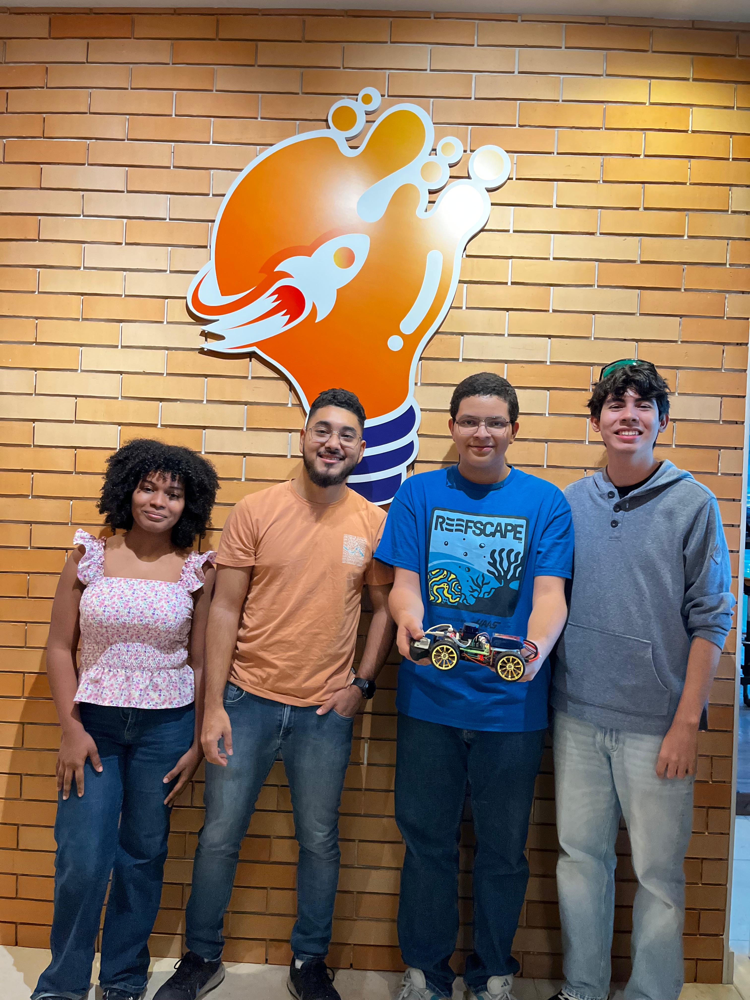 | 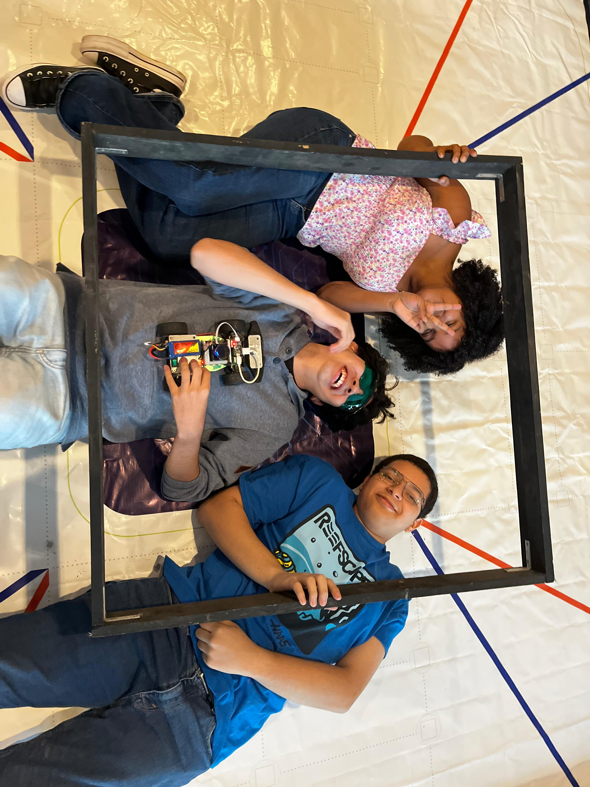 |

---

## 🚗 Vehicle View

Here you can see the full design of the vehicle from every angle. This detailed view helps to understand the layout of components and overall structure.

| Front | Back | Left |
|--------|---------|-----------|
| 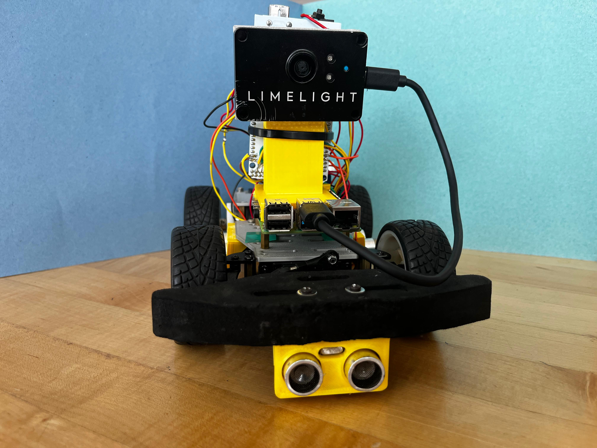 | 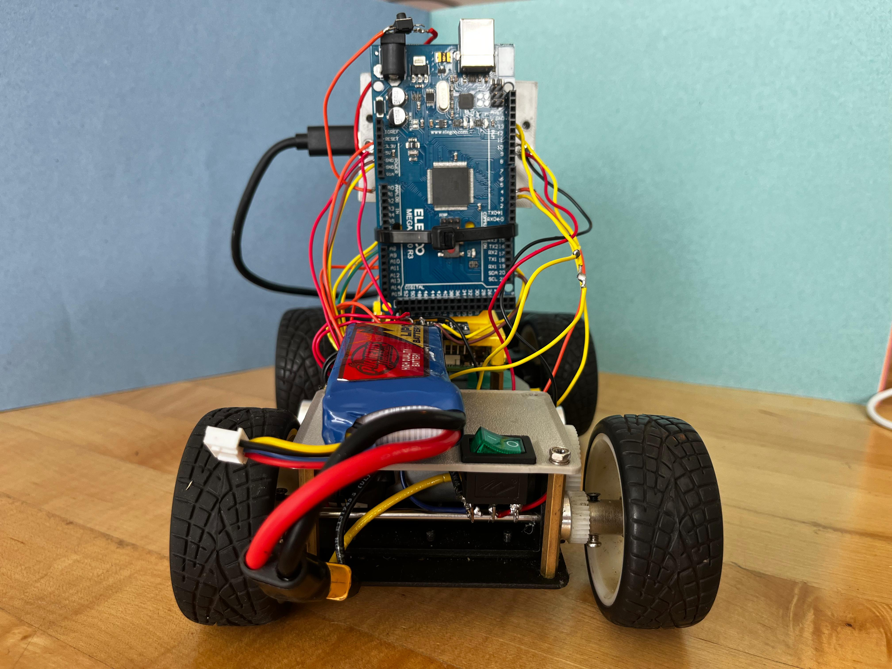 | 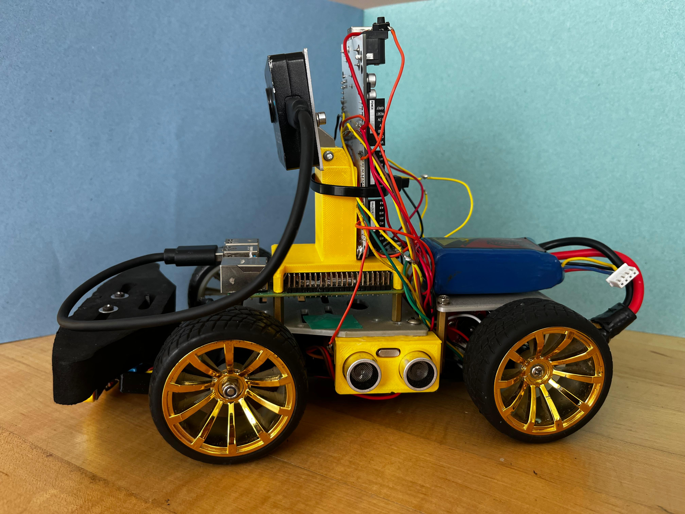 |

| Right | Top | Bottom |
|--------|----------|----------|
| 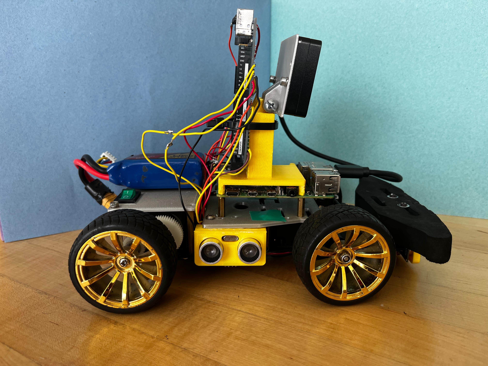 | 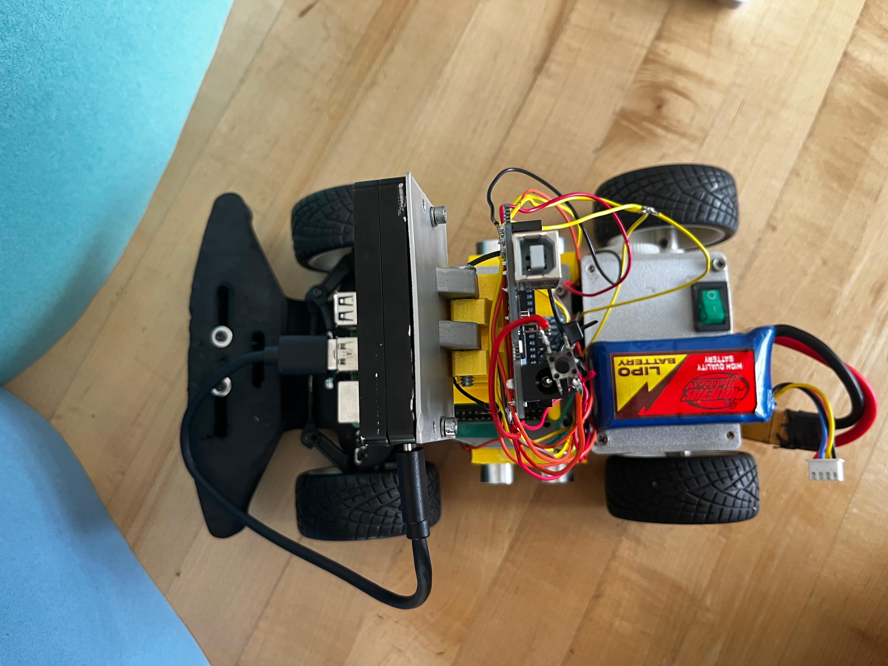 | 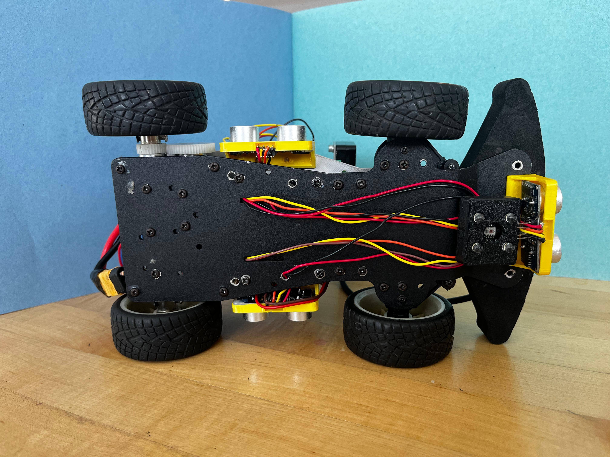 |

---
<h2 align="left">🧠 Electromechanical Components & Wiring</h2>

<table>
  <tr>
    <td align="center" style="padding:15px;">
      

        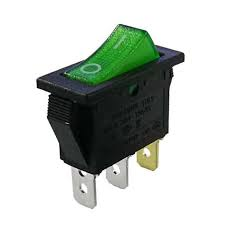 
        

          LiPo Battery 1200mAh 12V
        

      

    </td>

    <td align="center" style="padding:15px;">
      

        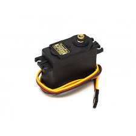 
        

          Raspberry Pi 4
        

      

    </td>

    <td align="center" style="padding:15px;">
      

        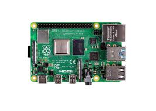 
        

          Limelight 3A
        

      

    </td>
  </tr>

  <!-- Repite la estructura para las demás filas -->

  <tr>
    <td align="center" style="padding:15px;">
      

        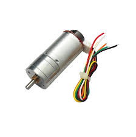 
        

          Servo MG945
        

      

    </td>

    <td align="center" style="padding:15px;">
      

        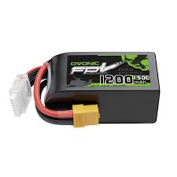 
        

          JGA25-370 Motor
        

      

    </td>

    <td align="center" style="padding:15px;">
      

        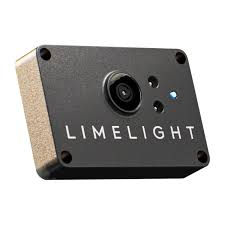 
        

          LM2596 Regulator
        

      

    </td>
  </tr>

  <!-- Continúa así con las demás filas -->

</table>

---

### 📊 Wiring Diagram

Below is the full electromechanical schematic that shows how everything is connected:

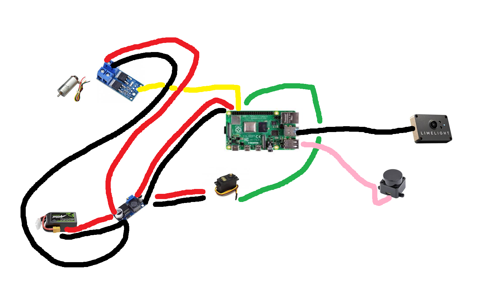

> You can find this image and other versions in the [`schemes`](schemes/) folder.

---

## ⚠️ Challenges During Development

Like any real-world project, we faced several challenges that pushed us to adapt, learn quickly, and find creative solutions. Here are some of the main issues we had to overcome:

- **LiDAR connection problems:** At the beginning, we couldn’t get the LiDAR to connect properly with our system. It took us a while to understand the communication protocol and configure it correctly so it would respond as expected.

- **Inaccurate data:** Even after establishing the connection, the data we received from the LiDAR was imprecise and unreliable. We had to tweak the reading filters and run several tests until we got stable and useful measurements.

- **Track border size issues:** We noticed that the track borders were 1 cm smaller than expected. This affected how our robot detected edges and navigated the course, so we decided to increase the borders by 1 cm to match the official measurements and avoid errors.

- **3D part adjustments:** We had to redesign a 3D-printed part that holds the LiDAR sensor. It needed to have just the right height so the LiDAR could rotate freely without hitting other components. This took some trial and error until we got it just right.

- **Camera configuration and lighting:** Object detection didn’t work well at first. We had to adjust settings like exposure and white balance, since lighting conditions were messing up the color and shape recognition. Proper calibration made a big difference.

