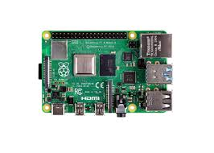

Engineering materials
====

This repository contains engineering materials of a self-driven vehicle's model participating in the WRO Future Engineers competition in the season 2022.

## Content

* `t-photos` contains 2 photos of the team (an official one and one funny photo with all team members)
* `v-photos` contains 6 photos of the vehicle (from every side, from top and bottom)
* `video` contains the video.md file with the link to a video where driving demonstration exists
* `schemes` contains one or several schematic diagrams in form of JPEG, PNG or PDF of the electromechanical components illustrating all the elements (electronic components and motors) used in the vehicle and how they connect to each other.
* `src` contains code of control software for all components which were programmed to participate in the competition
* `models` is for the files for models used by 3D printers, laser cutting machines and CNC machines to produce the vehicle elements. If there is nothing to add to this location, the directory can be removed.
* `other` is for other files which can be used to understand how to prepare the vehicle for the competition. It may include documentation how to connect to a SBC/SBM and upload files there, datasets, hardware specifications, communication protocols descriptions etc. If there is nothing to add to this location, the directory can be removed.

## Introduction

_This part must be filled by participants with the technical clarifications about the code: which modules the code consists of, how they are related to the electromechanical components of the vehicle, and what is the process to build/compile/upload the code to the vehicle’s controllers._

## How to prepare the repo based on the template

_Remove this section before the first commit to the repository_

1. Clone this repo by using the `git clone` functionality.
2. Remove `.git` directory
3. [Initialize a new public repository on GitHub](https://github.com/new) by following instructions from "create a new repository on the command line" section (appeared after pressing "Create repository" button).

<h2 align="center">Componentes</h2>

<table>
  <tr>
    <td align="center">
       
      <b>Lipo 1200mAh 12V</b>
    </td>
    <td align="center">
       
      <b>Raspberry Pi 4</b>
    </td>
    <td align="center">
       
      <b>Limelight 3A</b>
    </td>
  </tr>
  <tr>
    <td align="center">
       
      <b>Servo MG945</b>
    </td>
    <td align="center">
       
      <b>Lidar LD19</b>
    </td>
    <td align="center">
       
      <b>LM2596</b>
    </td>
  </tr>
  <tr>
    <td align="center">
       
      <b>PWM MOSFET Controller</b>
    </td>
    <td align="center">
       
      <b>Motor JGA25-370</b>
    </td>
    <td align="center">
       
      <b>Switch 3 Pines</b>
    </td>
  </tr>
</table>
