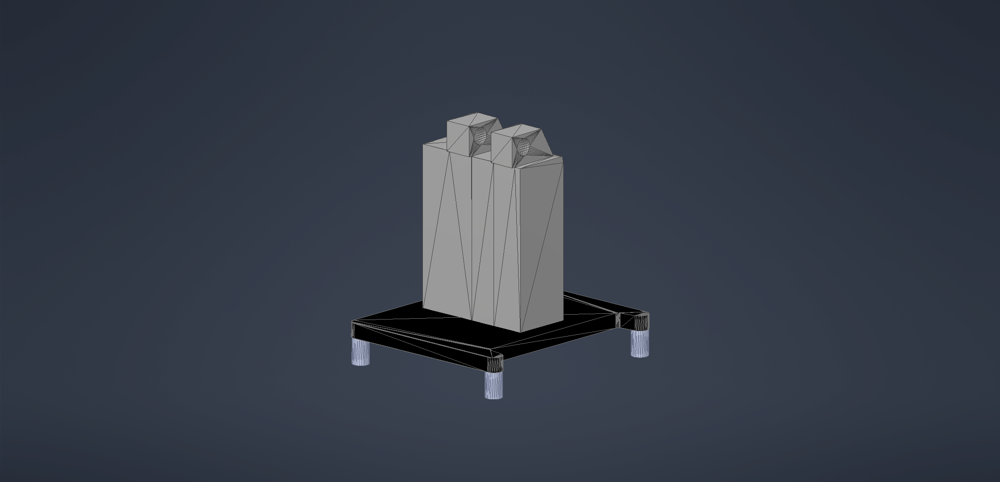

# CHISPA team – WRO 2025
---

---
Welcome to the official repository of the **CHISPA team**!  
This space contains all the resources, schematics, models, photos, and code developed for our participation in the **Future Engineers** challenge at the **World Robot Olympiad 2025**.

>[!NOTE]
>
>Here you’ll find detailed information about the design, functionality, and technical documentation of our autonomous vehicle.
>

---

## 📸 Team Photos

Below are two images that reflect our team’s identity:

| 📷 Official Photo | 😄 Fun Photo |
|------------------|--------------|
|  |  |

---

## 💻 Github folder structure/overview
```
🛜 WRO2025-CHISPATEAM
├── 📁 IMG # Images for internal use of the github
├── 📁 docs # Explanation of components/hardware/software
├── 📁 models # 3D parts ready to print
├── 📁 schemes # Schematic diagram of the robot, along with individual component images
├── 📁 src # Source code that powers the robot controllers
├── 📁 t-photos # Team pictures, the funny one and the official
├── 📁 v-photos # All angles of the robot
├── 📁 video # Videos of the robot preforming competition rounds
├── 📄 README.md # Introduction
├── 📄 LICENSE # AGPL 3.0 License Copy, prohibiting copy on other repositories without crediting the respective authors.
├── 📄 equipochis.jpeg # Official team image
```
---

## 🚗 Vehicle View

Here you can see the full design of the vehicle from every angle. This detailed view helps to understand the layout of components and overall structure.

| Front | Back | Left |
|--------|---------|-----------|
|  |  |  |

| Right | Top | Bottom |
|--------|----------|----------|
|  |  |  |

---

<h2 align="left">🧠 Electromechanical Components & Wiring</h2>

<table>
  <tr>
    <td align="center">
      <br>
      <b>3-Pin Switch</b>
    </td>
    <td align="center">
      <br>
      <b>Servo MG945</b>
    </td>
    <td align="center">
      <br>
      <b>Raspberry Pi 4</b>
    </td>
  </tr>

  <tr>
    <td align="center">
      <br>
      <b>JGA25-370 Motor</b>
    </td>
    <td align="center">
      <br>
      <b>LiPo Battery 1200mAh 12V</b>
    </td>
    <td align="center">
      <br>
      <b>Limelight 3A</b>
    </td>
  </tr>

  <tr>
    <td align="center">
      <br>
      <b>HC-SR04 Sensor</b>
    </td>
    <td align="center">
      <br>
      <b>L298N Motor Driver</b>
    </td>
    <td align="center">
      <br>
      <b>HC-SR04 Sensor</b>
    </td>
  </tr>

  <tr>
    <td align="center">
      <br>
      <b>GY-251 Gyroscope</b>
    </td>
    <td align="center">
      <br>
      <b>TCS3200 Color Sensor</b>
    </td>
    <td align="center">
      <br>
      <b>Arduino Mega</b>
    </td>
  </tr>
</table>


---

### Challenge Overview
The WRO 2025 Future Engineers category challenges student teams to design, build, and program a fully autonomous vehicle capable of navigating a dynamic and randomized racetrack. This vehicle must use sensors, computer vision, and advanced control algorithms to complete multiple laps with high precision. The challenge concludes with a demanding parallel parking maneuver requiring accuracy and control within a confined space 🚗🤖.

### Competition Format
- 🏁 **Open Challenge:** Complete three laps on a track featuring randomly placed inner walls. The vehicle should maintain stable trajectory control, demonstrating robustness and consistent performance throughout.  
- 🚦 **Obstacle Challenge:** Complete three laps while detecting and reacting to randomly placed red and green traffic markers:  
  - 🟥 Red markers require the vehicle to keep to the right side of the lane.  
  - 🟩 Green markers require the vehicle to keep to the left side of the lane.  
  Upon finishing these laps, the vehicle must locate the designated parking zone and execute a precise parallel parking maneuver within limited space 📐.  
- 📑 **Documentation:** Teams must maintain a public repository documenting all aspects of their engineering process, vehicle design, software development decisions, and source code. This provides transparency and demonstrates reproducibility and improved learning.

### Scoring & Evaluation
Judging is based on the following criteria:  
- **Precision:** Accuracy in lap completion, obstacle handling, and parking.  
- **Technical quality:** Clarity, organization, and completeness of project documentation and source code.  
- **Speed:** Total time to complete the challenge, balanced against precision.  
- **Innovation and robustness:** Judges value effective engineering decisions, software reliability, and creative solutions that enhance autonomous performance 💡⚙️.

### Robot Performance: Speed and Maneuvering
Our vehicle's average velocity on straight sections is approximately **1.2 meters per second**, enabling fast and stable lap completion. In contrast, during turns and cornering maneuvers, the speed reduces to about **1.7 meters per second** on average to ensure stable handling and precise navigation. The control algorithm dynamically adapts motor power and steering angles based on sensor feedback, maintaining optimal traction and avoiding drift even in tight curves.

---

### Key Components

| Component                 | Description                                                |
|---------------------------|------------------------------------------------------------|
| **Arduino Nano ESP32**    | High-performance microcontroller for sensor and motor control |
| **OpenMV H7 Camera**      | Embedded vision sensor for traffic signal and obstacle detection |
| **HC-SR04 Ultrasonic Sensors (3x)** | For proximity sensing and wall following                        |
| **MG90S Servo Motor**     | Steering actuator with high torque and precise control    |
| **Pololu 30:1 Gearmotor** | Drive motor providing balanced speed and torque           |
| **IFX9201SG Motor Driver**| Efficient PWM motor driver with built-in protections      |
| **Li-Po Battery (7.4V, 300mAh)** | Compact power source optimized for duration and weight           |
| **3D-Printed Chassis**    | Lightweight, custom mechanical structure                   |

### Strengths and Innovations
- **Advanced vision processing:** Real-time color and shape detection for robust environment understanding.  
- **Precise sensor fusion:** Combining data from IMU, ultrasonic sensors, and camera enables stable navigation under varying conditions.  
- **Dynamic speed control:** Adapting velocity in straight lines versus curves increases efficiency without sacrificing control.  
- **Modular design:** Easily upgradable hardware and software architecture supports iterative development and rapid testing.  
- **Comprehensive documentation:** Detailed instructions and open-source code improve learning and foster community collaboration.

---

### Index
- [Challenge Overview](#challenge-overview)  
- [Competition Format](#competition-format)  
- [Scoring & Evaluation](#scoring--evaluation)  
- [Robot Performance](#robot-performance-speed-and-maneuvering)  
- [Key Components](#key-components)  
- [Strengths and Innovations](#strengths-and-innovations)  


### 📊 Wiring Diagram

Below is the full electromechanical schematic that shows how everything is connected:


> You can find this image and other versions in the [`schemes`](schemes/) folder.

---

## 🔧 Components and Sensor Integration

Our robot was built using a mix of modular components from an existing kit and custom-designed 3D printed parts to fit the needs of the Future Engineers challenge. This hybrid approach allowed us to maximize the strengths of reliable, pre-tested hardware while also tailoring specific solutions for unique tasks in the mission. Below is a highly detailed breakdown of all the components we used, their technical roles, the integration logic, issues we faced, and how we adapted to overcome them. Our documentation not only reflects the functionality of each part, but also highlights the engineering decisions made throughout the robot’s development.

### 🔋 Power Supply 

**LiPo Battery 1200mAh 12V**

- Powers the entire robot system, ensuring both mobility and computational processing are supported throughout the match.  
- Provides stable power output for the motors, sensors, Raspberry Pi, and Arduino.  
- We used a voltage regulator to avoid current spikes and protect delicate components like microcontrollers.  
- This solution helped mitigate early issues we faced with sudden shutdowns during intensive operations.  
- A battery monitor was also incorporated to measure real-time voltage and alert us when levels dropped too low.

### 💻 Main Controllers

**Raspberry Pi 4**

- Acts as the central processing hub of the robot.  
- Responsible for image processing, decision-making logic, and managing sensor data.  
- Runs Python scripts to interpret input from the Limelight and communicates with the Arduino through a serial interface.  
- Its high-speed processing capabilities allow us to manage simultaneous tasks like pathfinding, obstacle avoidance, and turn correction.  

**Arduino MEGA**

- Controls low-level tasks such as PWM motor control and real-time sensor readings (e.g., ultrasonic distance, servo movements).  
- Acts as a reliable bridge for deterministic behavior in the hardware layer.  
- The division of responsibilities between Pi and Arduino helped us balance computational load and reduce latency.  
- Simplifies hardware debugging and guarantees fast, responsive control signals.

### 👁️ Object Detection & Tracking

**Limelight 3A**

- Originally designed for FRC robots, this powerful camera system was adapted to fit our smaller robot.  
- Detects and locks onto specific colored or shaped objects.  
- Enables autonomous navigation by marking visual targets and aligning accordingly.

**Challenges:**  
- Required a well-lit and consistent environment to provide reliable data.  
- We adjusted the robot’s onboard lighting and modified thresholds in the Limelight software to improve reliability.  
- Integrated a protective mount and anti-vibration dampers to stabilize image input.

### 🚫 Removed Component

**LDrobot Lidar LD19**

- Initially selected for real-time SLAM and environment scanning.

**Why We Stopped Using It:**  
- Provided unstable and inconsistent results in small, confined spaces.  
- Difficulty detecting nearby walls and objects due to reflection noise.  
- Calibration proved time-consuming and performance did not justify complexity.

**Our Solution:**  
- Replaced with strategically placed ultrasonic sensors and a reliable gyroscope to manage spatial awareness with much greater efficiency.  
- This switch greatly improved the consistency and reduced computational load.

### 🔄 Motor Control

**L298N Motor Driver**

- Dual H-Bridge driver that allows for direction control and PWM-based speed adjustment.  
- Initial controller suffered overheating; L298N offered a robust and thermally safer alternative.  
- Equipped with a built-in heat sink to improve heat dissipation as this controller gets hot quickly.

**JGA25-370 Gear Motors**

- Provides strong torque and reliable performance, especially during turns and ramp climbs.  
- Compatible with our power source and robust enough for repeated high-load operations.  
- Low RPM ensures accurate control in precision-based movement challenges.

**Servo MG945**

- Handles the turning of the robot left/right.
- Durable metal gears ensure precision and long operational lifespan.  
- Integrated with custom 3D-printed brackets to prevent misalignment and slippage.

### 🔊 Sensors for Navigation and Detection

**HC-SR04 Ultrasonic Sensors**

- Function: Detect distance to nearby objects and walls.  
- Technical Accuracy: ~3mm, max range 4m.  
- Usage: Placed on both front and side of robot to measure proximity and assist in avoiding wall collisions.  
- These sensors play a critical role in maintaining correct lane alignment and determining when to make turns.  
- We added foam dampers around the sensors to reduce interference from ground reflections.

**GY-251 Accelerometer + Gyroscope (MPU6050-based)**

- Function: Detects angular velocity and tilt.  
- Usage: Guides the robot’s heading during turns and confirms straight-line travel.  
- Essential for making consistent 90° turns and for recalibration during complex movements.  
- Mounted at the center of gravity to reduce noise and increase accuracy.

**TCS3200 Color Sensor**

- Function: Reads floor tile colors to guide robot’s path.

**Issues and Solutions:**  
- One unit had significant lag and failed to detect color transitions in motion.  
- Another sensor misidentified multiple colors and only read orange with high confidence.  
- Calibration trials under consistent lighting; replaced the malfunctioning unit with a higher-quality clone.

**Accuracy Reference (sourced from mixed data):**

| Color  | Accuracy (%) |
|--------|--------------|
| Red    | 92%          |
| Green  | 89%          |
| Blue   | 94%          |
| Yellow | 87%          |
| Orange | 96%          |
| White  | 91%          |
| Black  | 88%          |

## (see [docs](https://github.com/randomx10/WRO2025-CHISPATEAM/tree/main/docs) for more information)

### 🔌 Power & Regulation

**LM2596 Voltage Regulator**

- Converts 12V from LiPo battery to stable 5V required by sensors and controllers.  
- Fine-tunable and heat-resistant, preventing power-related failure during operation.  
- Easy to replace and adjust for different output requirements during testing phases.

**3-pin Toggle Switch**

- Allows safe, manual powering of the entire robot without direct battery disconnection.  
- Placed on the back panel for convenient access and safety during handling.

---

## 🛠️ Robot Construction Guide

This guide explains how to assemble the chassis, drivetrain, electronics, and software for the WRO2025-CHISPATEAM robot. Each step is short and practical so the build can be reproduced reliably.

### Step 1: Assemble the steering system ⚙️
- Print the steering-related 3D parts located in `/models` (servo bracket, horn spacer, steering hubs).  
- Mount the Servo MG945 securely to the chassis using screws and the 3D-printed bracket; verify there is no flex under load.  
- Connect the steering axle/linkage to the MG945 horn with a proper coupler; ensure full sweep without binding.  
- Install the front steering hubs and verify the arm moves freely and does not collide with the chassis or wiring.  
- Center the servo (neutral PWM) and align wheels to straight-ahead before tightening horn screws.

### Step 2: Assemble the powertrain 🚗
- Fix the JGA25-370 gear motors onto their 3D-printed motor mounts; use thread-lock where appropriate to prevent loosening.  
- Couple each motor shaft to the driven axle/gear as per the mount design; confirm no eccentricity or wobble.  
- Check clearance so gears and wheels rotate without rubbing the chassis under load.

### Step 3: Mount the electronics 🔌
- Attach the LiPo 12V 1200 mAh battery in a protected position; add foam or straps to avoid vibration and impacts.  
- Install the LM2596 regulator and set a stable 5 V output for logic and sensors; verify with a multimeter before connecting boards.  
- Place the Raspberry Pi 4 and Arduino MEGA on standoffs; route power via LM2596 and keep high-current lines separate from signal lines.  
- Mount the Limelight 3A on a rigid, slightly angled bracket; add anti‑vibration pads to stabilize the image.  
- Position the HC‑SR04 ultrasonic sensors (front and side) with a clear field of view; add small foam skirts if floor reflections are an issue.  
- Mount the GY‑251 (MPU6050) close to the robot’s center of gravity, flat and isolated from motor vibrations.

### Step 4: Attach the wheels 🛞
- Mount front wheels on the steering hubs; ensure free rotation and zero lateral play.  
- Install rear wheels on the driven axle linked to the JGA25‑370; add spacers or washers to maintain alignment.  
- Spin each wheel by hand and listen for rubbing or gear mesh noise; adjust until smooth.

### Step 5: Preparation for operation ✅
- Check that the chassis is balanced and that cable runs are secured away from moving parts.  
- Verify all screw joints are tight; re‑center the servo and confirm steering endpoints do not stall the MG945.  
- Power on with a current‑limited supply the first time; confirm 5 V rail remains stable under sensor and servo load.

### Step 6: Software setup 💻
- On Raspberry Pi 4, deploy the Python services for vision (Limelight integration), decision logic, and Pi↔Arduino serial link.  
- On Arduino MEGA, upload the low‑level firmware handling PWM motor control, servo steering and real‑time sensor reads.  
- Test the serial protocol: the Pi should stream targets/commands, the MEGA should acknowledge and actuate deterministically.  
- Calibrate sensors:  
  - Limelight thresholds/lighting profile.  
  - Ultrasonic baselines and timeouts.  
  - MPU6050 gyro bias at rest.  
- Run a dry test on blocks (wheels off the ground) to validate direction, steering sign, and emergency stop.

---


## 🧠 How It All Works Together

Our robot was developed for the WRO 2025 Future Engineers Challenge, a task requiring navigation of a color-coded maze, obstacle avoidance, and accurate maneuvering. To achieve this, we implemented a layered control strategy:

**Color Sensing:**  
- The robot follows a line/path system on the floor, detecting color patterns using the TCS3200.  
- Decisions (turns, stops, or interactions) are triggered based on detected color.  
- Logic is reinforced with timeouts and counters to avoid misreads from transient reflections.

**Obstacle Avoidance:**  
- HC-SR04 sensors measure distances in real-time.  
- On detecting an object or wall within a threshold, the robot adjusts trajectory accordingly.  
- In edge cases, the gyroscope is consulted to determine alternative safe paths.

**Turning & Direction Control:**  
- Using GY-251 gyro data, we ensure consistent 90° turns.  
- Helps correct drift and ensures we remain aligned with map paths.  
- Combined with encoder data for better positional awareness.

**Central Coordination:**  
- The Raspberry Pi processes high-level logic and forwards simplified instructions to the Arduino.  
- This modular separation allows real-time reaction to environmental data while executing long-term movement plans.  
- Logs are stored locally for later debugging and performance analysis.

**Structural Customization:**  
- We modified kit-based chassis with 3D-printed mounts for better sensor placement and airflow.  
- This helped avoid overheating and mechanical misalignments during long test sessions.  
- The design is compact yet expandable, making it ideal for future missions.

**Component Testing and Iteration:**  
- Every part of the robot went through unit testing and stress evaluation.  
- We documented all observed limitations and iteratively improved sensor placement and code logic.  
- Testing environments included both simulated and real-field trials.

By overcoming major hurdles like sensor inconsistency, voltage fluctuations, and Lidar misreadings, we developed a system that is adaptive, stable, and ready to complete the mission using components we understand deeply. Our documentation, design, and testing reflect a clear engineering vision with flexibility and resilience at its core.

In summary, the robot reflects a balance between innovation and practicality — leveraging what we have while adapting smartly to meet the demands of a complex and evolving challenge. Our engineering choices were made with precision, and the modular approach means the robot is easy to repair, extend, and reconfigure if necessary. We’re proud of its development and look forward to testing it further on the competition field.


<h2 align="left">🧩 3D Printed Parts</h2>

<p>
In this section, you will find the 3D printed components that were essential to the design and functionality of our robot. These pieces were specifically created to optimize vision and structural support while keeping the overall weight of the robot low and ensuring precise alignment of key systems.
</p>

<table>
  <tr>
    <td align="center">
      <br>
      <b>Limelight Mount</b><br>
      One of the most important printed pieces is the mount for the Limelight camera. We designed it to keep the vision system stable and in the right position to detect the traffic signals and track targets efficiently. The angle was carefully adjusted to increase field of view and reduce blind spots. It’s lightweight but solid enough to hold the camera steady, even during fast movements. This improvement helped us gain more accuracy and align much better with our objectives.
    </td>
    <td align="center">
      <br>
      <b>Top Chassis Support</b><br>
      This structural support is placed on the top part of the chassis and was designed to hold sensors, wiring, and additional modules in place. One of the main goals was to improve the internal layout of the robot, keeping everything organized and making maintenance easier. It also adds an extra layer of protection to the internal electronics. This part was printed using strong filament to ensure rigidity and durability, without affecting the balance of the robot.
    </td>
  </tr>
</table>

<p>
Both of these components were modeled in CAD software and tested through multiple iterations before reaching the final versions. The printing process took several hours for each, but the result was worth the effort, as they improved our performance significantly during testing and competition.
</p>


## 🎯 Competition Challenges

<table align="center" border="1" cellspacing="0" cellpadding="8">
  <tr>
    <!-- Open Challenge card -->
    <td valign="top" width="360">
      <div>🔗 Open Challenge</div>
      <div align="center">
        
      </div>
      <div align="center">
        <a href="https://www.youtube.com/watch?v=e4CDzBtp_W8">Watch Open Challenge Round</a>
      </div>
    </td>
  </tr>
</table>

   
##  Track Performance

Our vehicle is tuned for stable, repeatable lap times by adapting speed and steering to the track segment: it targets approximately 1.2 m/s on straight sections and about 1.7 m/s through turns, with smooth ramp-up and ramp-down around each corner to preserve traction and heading control.

#### Key metrics
- Straight-line speed: ~1.2 m/s, with high-frequency heading corrections to stay centered in the lane.
- Cornering speed: ~1.7 m/s, limited by lateral acceleration and line-of-sight constraints near inner walls.
- Transitions: short acceleration/brake ramps before/after the apex to avoid over/understeer.
- Stability: yaw-based PD keeps the car aligned; exit lines are corrected quickly after each corner.

| Parameter          | Straights            | Turns                         |
| :----------------- | :------------------- | :---------------------------- |
| Target speed       | ~1.2 m/s             | ~1.7 m/s                      |
| Primary control    | Gyro-based PD (yaw)  | Gyro PD + lateral accel cap   |
| Acceleration       | Smooth, traction-first | Suppressed at apex, recover on exit |
| Corrections        | Small, high-rate     | Moderate, radius-dependent    |

#### How it works
- Pre-aiming into corners: the controller slightly reduces speed and applies steering in advance so the vehicle is already stable at corner entry.  
- Lateral acceleration limiter: while cornering, the controller caps lateral demand; if heading error rises, it briefly trims speed to regain grip.  
- Corner exit: past the apex, the system straightens steering and restores speed to the 1.2 m/s target, prioritizing a clean trajectory over peak thrust.  
- Line and wall biasing: near inner walls, the lateral offset is adjusted to keep safe clearance without adding unnecessary steering oscillations.

#### Measurement assumptions
- Test track uses standard surface and markings; tires are calibrated and warmed up.
- The 1.2 m/s (straights) and 1.7 m/s (turns) targets can vary slightly with temperature, tire wear, and lighting.
- Practice sessions should log section times to verify consistency; comparing segment splits is recommended for tuning.


> [!WARNING]
>
> This program is distributed in the hope that it will be useful,
> but WITHOUT ANY WARRANTY; without even the implied warranty of
> MERCHANTABILITY or FITNESS FOR A PARTICULAR PURPOSE.
> If any portion of this program is to be used in any other application, you must
> credit the respective authors and provide a copy of the AGPL 3.0 License.
> [More information on LICENSE.](https://github.com/randomx10/WRO2025-CHISPATEAM/blob/main/LICENSE)
> 


