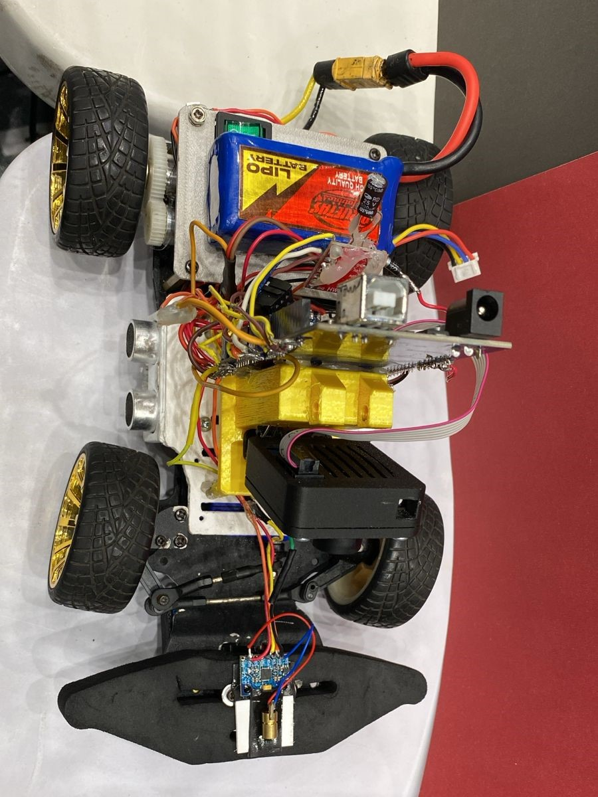
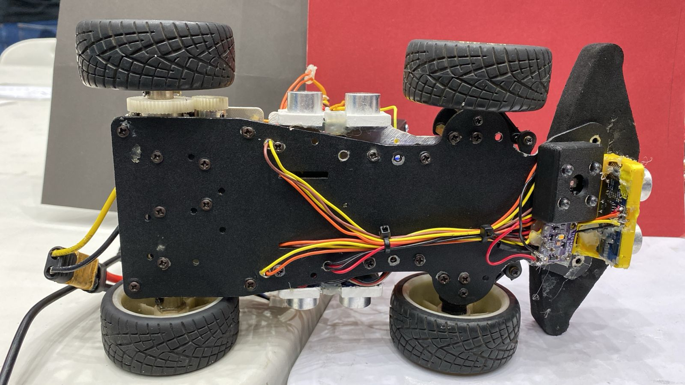

<h2 align="center">Vehicle's Photos</h2>

<table>
  <tr>
    <th>Front</th>
    <th>Right</th>
    <th>Back</th>
  </tr>
  <tr>
    <td></td>
    <td></td>
    <td></td>
  </tr>
  <tr>
    <th>Left</th>
    <th>Top</th>
    <th>Bottom</th>
  </tr>
  <tr>
    <td></td>
    <td></td>
    <td></td>
  </tr>
</table>
